# Hazelcast Task 2

This repository contains Python code that fulfils the requirements of Task 2 from
"Hazelcast" assignment.

## Requirements

* Python 3.8+
* [hazelcast-python-client](https://hazelcast.com/clients/python/)
* Hazelcast server (three nodes) running locally.
  You can start three nodes with the official Docker image:

```bash
# start three containers in the same network
sudo docker network create hz-net

sudo docker run -d --name hz1 --network hz-net -p 5701:5701 \
  -v $(pwd)/hazelcast.yaml:/opt/hazelcast/config/hazelcast.yaml \
  -e JAVA_OPTS="-Dhazelcast.config=/opt/hazelcast/config/hazelcast.yaml" \
  hazelcast/hazelcast:5.3

sudo docker run -d --name hz2 --network hz-net -p 5702:5701 \
  -v $(pwd)/hazelcast.yaml:/opt/hazelcast/config/hazelcast.yaml \
  -e JAVA_OPTS="-Dhazelcast.config=/opt/hazelcast/config/hazelcast.yaml" \
  hazelcast/hazelcast:5.3

sudo docker run -d --name hz3 --network hz-net -p 5703:5701 \
  -v $(pwd)/hazelcast.yaml:/opt/hazelcast/config/hazelcast.yaml \
  -e JAVA_OPTS="-Dhazelcast.config=/opt/hazelcast/config/hazelcast.yaml" \
  hazelcast/hazelcast:5.3
```

Each container listens on port 5701 internally; we expose them on 5701/5702/5703
on the host so the Python client can connect.

Alternatively you can run the `hazelcast.jar` binary directly three times; see
Hazelcast documentation linked in the assignment.

## How to run

Install the client library:

```bash
pip install hazelcast-python-client
```

then execute the demo script:

```bash
python hazelcast_task2.py
```

### Task 1 & 2 & 3:

We have already mentioned how to run and configure the program.

Now we need to run the Management Center:
```bash
sudo docker run -d --name hz-mancenter --network hz-net -p 8080:8080 hazelcast/management-center:latest
```

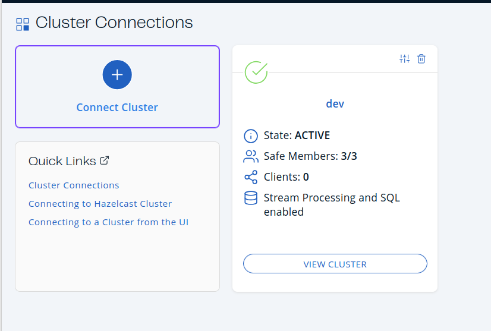

Here we can see result of program run:
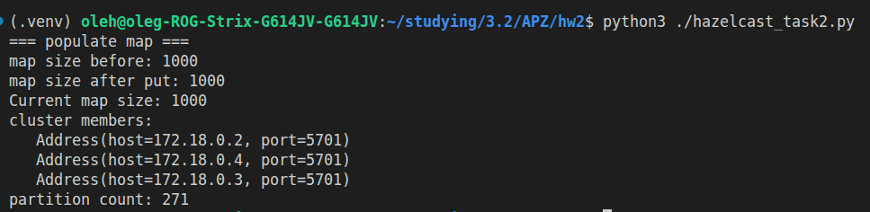


We can see in the manager center that distribution is not perfect, but close to it:
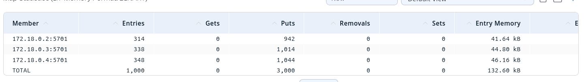

Now let's get to the experiments:

1. Shut down first node:
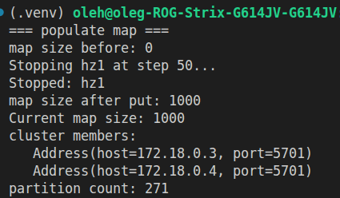
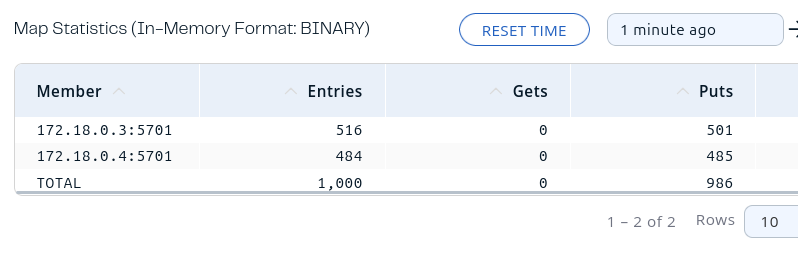

2. Shut down 2 nodes sequentialy node:
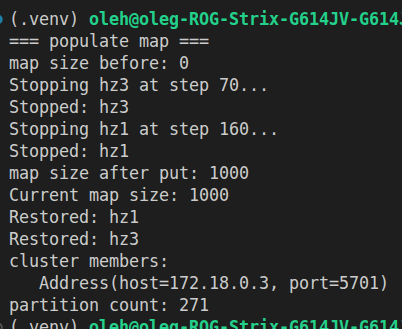
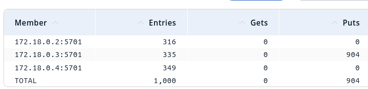

3. Shut down 2 nodes at a time:
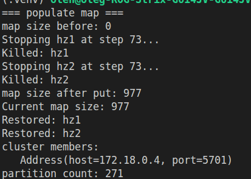
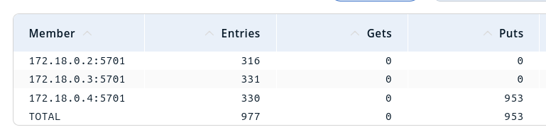

As we can see we get some data loss at all level of shut down also we may see how long in time it takes to restore data from fallen nodes.

To fix this issue we may use:
such additional cofiguration to clusters:
```yaml
hazelcast:
  map:
    default:
      backup-count: 2
```

It would give every node a backup of others nodes. Let's run for the worst scenario now (kill 2 nodes):
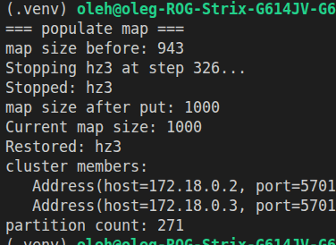
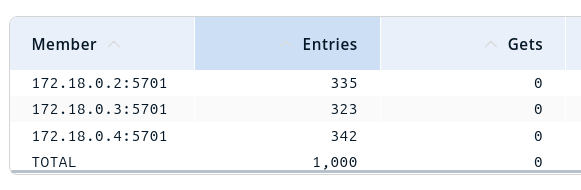

### Task 4 & 5 & 6 & 7:

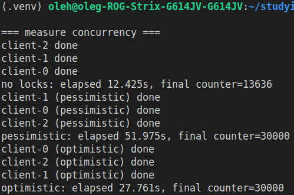

1. in first experiment we obviously cound not get 30000 (only if we were very lucky (but we won't)).
It happens because: for instance we have number 10, node1 and node2 take this number add to it 1 and put
back to the map even though we did 2 incrementing operations on 10 we still got 11. Also we may observe that
experiment gave us number of 13636 which means nodes works practically in the same 'temp' (the number is
close to 10000 which means it is close to the full work of 1 node with a bit of overwork), it makes this method very unefficient.

2. Indeed Pessimistic and Optimistic methods works without dataloss (and of cource it increased execution time, for pessimistic:
in ~4 times and for optimistic in ~2 times).

3. Optimistic works faster in 2 times. Basically, in our case Optimistic is batter, but Pessimistic might be used for other reasons:
  1. Strong correctness guarantee: once you hold the lock, no other transaction can modify the resource — easy to reason about.
  2. Good for high-conflict workloads: avoids wasted work (no retries) when contention is frequent.
  3. Simpler business logic: you don’t need complex retry/compensation logic after conflicts.
  4. Useful for long transactions where state must remain stable for the whole operation.

On the other hand optimistic's benefits are:
  1. High concurrency and throughput when conflicts are rare (reads don’t block).
  2. No long-held locks so lower risk of blocking and fewer deadlocks.
  3. Better fit for distributed systems using version checks or CAS (compare-and-swap).
  4. Often simpler to scale because you avoid centralized locking coordination.

Overall comparison:
Use pessimistic locking when:
  1. Conflicts are common, or
  2. Transactions are long or cannot be safely retried, or
  3. You require strict serializability with minimal application complexity.

Use optimistic locking when:
  1. Conflicts are rare, or
  2. You need high read throughput and scalability, or
  3. You can implement safe retry/compensation logic.

To sum up I would say there are practically no 'bad' methods, most of them just situational (this statement may describe the whole software architecture by the way).

### Task 8:

Bounded queue additional settings:
```yaml
hazelcast:
  queue:
    bounded:
      max-size: 10
```

Because a Hazelcast Queue is a standard FIFO (First-In-First-Out) data structure, the two consumers will read the values competitively and exclusively.

  No Duplication: Each number (1 to 100) will be read by only one of the consumers. If consumer1 takes the number 1, it is removed from the queue, and consumer2 will never see it.

  Load Distribution: The numbers will be distributed between the two active consumer threads. You will likely see alternating outputs (e.g., consumer1 got 1, consumer2 got 2, consumer1 got 3), though exact strict alternation is not guaranteed depending on thread scheduling and network latency.

Check promgram work:
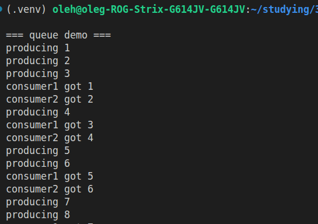
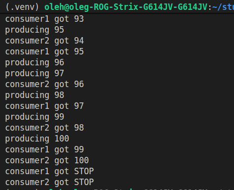

To check behaviour withour reading we need to do this:
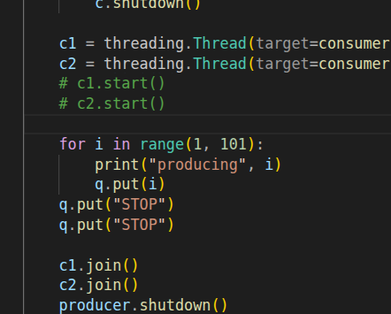

As the result we get:
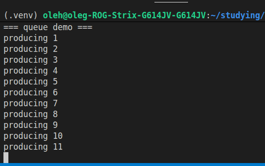

Such behaviour happens because no one reads from the queue and nobody can write
there as queue already full (reached size of 10), so we get deadlock.

For some conclusion:
Close all:

```bash
sudo docker stop hz1 hz2 hz3
sudo docker rm -f hz1 hz2 hz3
sudo docker rm -f hz-mancenter
sudo docker network rm hz-net
```
